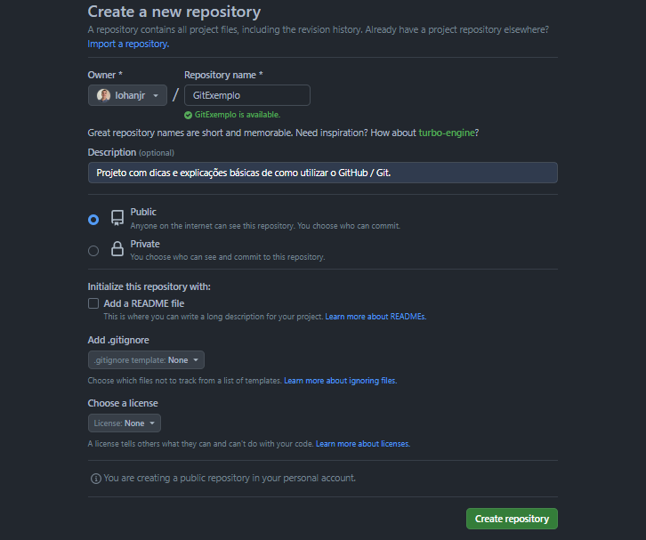
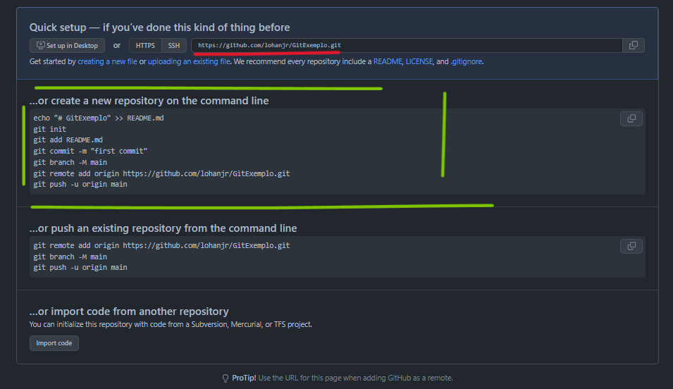

# Aprendendo a utilizar o Git/GitHub :)

Olá, irei colocar aqui alguns comandinhos e atalhos como dicas que venho aprendendo.

A lógica que iremos seguir será, estabelecer uma conexão entre seu repositório local ao remoto do _Github.com_! Para nos possibilitar segurança e versionamentos(alterações individuais ou em equipe) ao desenvolver o projeto.

_-PS: Vou me basear na situação em que você já possui o(s) arquivo(s) do seu projeto salvo no seu dispositivo..._

## Criando um novo repositório...

* Dê um `Git Bash Here` na pasta pai em que seus arquivos se encontram, o terminal irá se abrir já no caminho correto.

* Dê um `git init`, para assim, inicializarmos um repositório vazio. O interessante é que se, no _Explorador de Arquivos_ clicarmos na opção "Vizualizar > Itens Ocultos". Poderemos ver que uma pasta oculta foi adicionada, com nome: <b>.git</b>
- PS: Ela será responsável pela conexão, não a modifique.

* Com o comando `git status`, poderemos ver a situação atual da configuração, nesse momento, irá aparecer os arquivos filhos presentes na pasta, com a situação: "Untracked" ou 'Não Rastreado', pois ainda não os adicionamos.

* Iremos fazer esse passo, com o comando `git add <your_file>`, caso haja mais de uma pasta de arquivo, insira o nome da primeira e dê um espaço e assim sucessivamente, até chegar ao final.

* Após isso, os arquivos adicionados entram em um modo de _"standing"_, sendo similar à uma sala de espera, apenas aguardando ser chamado, veremos o responsável por essa ação é o `git commit -m "here goes the title of your commit"`, sendo assim salva as alterações *localmente*, o _"-m"_ serve para adicionarmos um título/descricção do que está sendo feito e(ou) alterado.

*  Agora iremos nos atentar à nomenclatura do repositório. Podemos perceber no final do caminho de arquivos, o termo em parênteses "(master)", isso significa que, o ramo principal do projeto ou _branch_, está nomeada como 'master', como padrão, mas isso vem sendo mudado por X questões que você pode posteriormente se aprofundar caso queira. Portanto, usaremos o comando `git branch -M "main"`

Agora precisamos criar um novo repositório em seu perfil do GitHub por algum navegador, no caminho: https://github.com/yourGitHubUserName?tab=repositories, basta você adicionar seu nome neste lugar: _"yourGitHubUserName"_, no botão verde *NOVO*.

Após isso, teremos:

Como podemos ver, devemos criar um repositório dessa forma.

Então chegaremos ao próximo passo:

Sendo assim, podemos avançar a próxima etapa.

_PS: Se atente ao link grifado em vermelho._

* Com o link copiado, iremos novamente abrir o Git Bash e utilizar o código `git remote add origin https://github.com/lohanjr/GitExemplo.git`, esse comando irá indicar o caminho do seu diretório para a conexão remota, como o nome já diz.