# Aprendendo a utilizar o Git/GitHub :)

Olá, irei colocar aqui alguns comandinhos, atalhos e dicas🤩 do que venho aprendendo com o Git.

A lógica que iremos seguir, será estabelecer uma conexão entre seu repositório local ao remoto do _Github.com_! Para nos possibilitar segurança, facilidade e versionamentos(alterações individuais ou em equipe) ao desenvolver o projeto.

> _PS: Vou me basear na situação em que você irá criar um repositório novo, um que não tenha arquivos..._

## - Criando um novo repositório

* Ao acessar sua conta do GitHub, na página inicial, você irá clicar no botão _New._

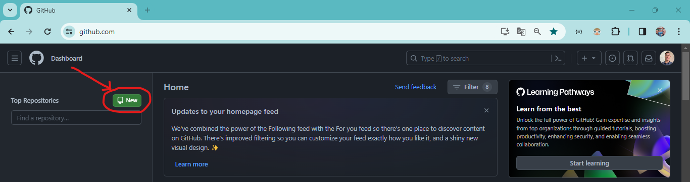

* Após isso, você terá que nomear o seu novo repositório e, caso queira, adicionar uma descrição a ele.


> Não iremos marcar a opção de _Add a README file_ agora, pois iremos abordar esse assunto posteriormente.

Sendo assim, já criamos o repositório remoto no servidor do GitHub, basta conectarmos os arquivos que iremos criar na nossa máquina a ele. E para fazer isso, vamos utilizar a linha de comandos Git Bash e seguir alguns passos que o GitHub nos fornece.


O link grifado em vermelho, é o URL do repositório Git remoto no GitHub, que é usada para fazermos a conexão entre o local e remoto, sendo super importante.</br>
E iremos utilizar os comandos que foram contornados em verde, para concluirmos a conexão e envio de arquivos.

## Escolhendo o diretório

Vamos agora, para a área de trabalho, para termos um ambiente visualmente limpo para iniciarmos.

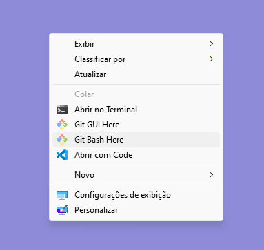

* Use o botão direito do mouse e clique em _Git Bash Here_, a linha de comando então será aberta. Agora, você terá que escolher ou criar uma pasta, onde iremos criar nossos arquivos e dar ínicio ao repositório local.

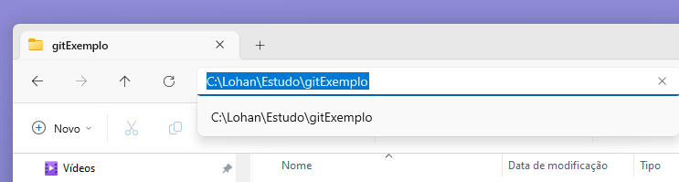

* Após decidir o diretório, basta copiar o caminho e colá-lo no Git Bash, com o comando:
```bash
cd "C:\gitExemplo"
```

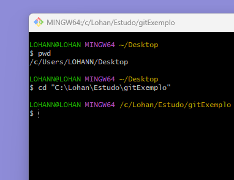

> `pwd` nos mostra em qual caminho nos encontramos no momento

> `code .` abre o diretório em que estamos no Visual Studio Code

Note que o meu caminho será C:\gitExemplo, basta substituir pelo seu!

## Iniciando repositório git

* De volta ao console do Bash, iremos dividir a tela com o Explorador de Arquivos, ambos programas no mesmo caminho, para visualizarmos o que irá acontecer. 

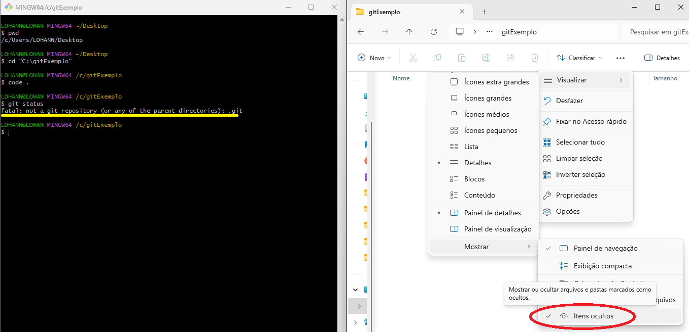

> No Explorador de Arquivos, clique na opção "Vizualizar > Itens Ocultos"

No Bash, dê um:

```bash
git status
```

Com esse comando, recebemos o feedback do status geral do repositório, informações como: status de arquivos adicionados, branch atual etc.</br>E podemos ver na resposta grifada em amarelo, que o diretório ainda não é um repositório git.</br>Agora, iremos criar de fato o repositório, com o comando:

```bash
git init
```

Para assim, inicializarmos um repositório vazio.

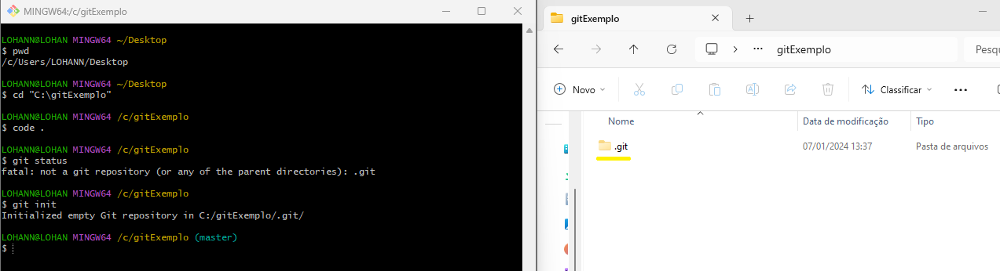

* O interessante é que após esse comando, poderemos ver grifada em amarelo, que uma pasta oculta foi adicionada, com nome: <b>.git</b>
> _PS: Ela será responsável pela conexão, não a modifique._

## Criando os primeiros arquivos

Iremos agora, clicar em _New File..._ e escolher um nome para o arquivo e o tipo do arquivo, que no caso, será _.md_ 

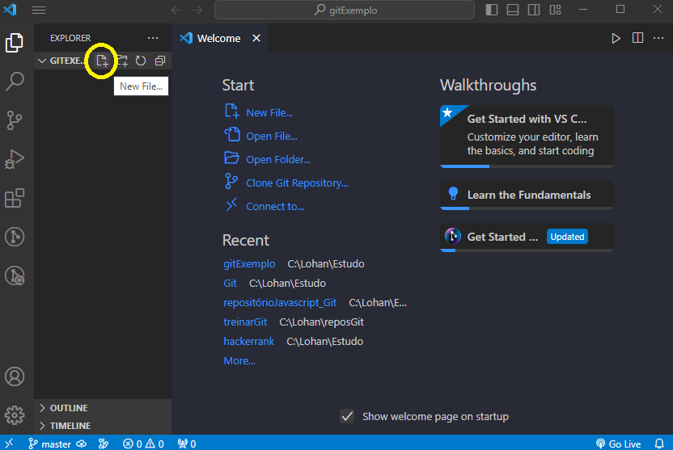

O nome que irei escolher será o padrão para esse tipo de arquivo, _README.md_.</br>Agora, iremos colocar um título à esse MarkDown (md):

Perceba que está aparecendo a letra em verde _U_, ela significa que o arquivo se encontra _Untracked_ ou "Não Rastreado", pois ainda não o adicionamos.

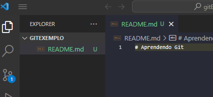

* Para isso, iremos utilizar o seguinte comando: 

```bash
git add filename
```

> O _filename_ no caso, é _README.md_, basta substituir.

---
### Dicas:


Caso haja mais de um arquivo, e você queira adicionar todos, use o comando:

```bash
git add .
```

Caso tenha vários arquivos mas você queira adicionar somente algum deles, insira o nome dos respectivos arquivos um por um, separados por espaço, até chegar ao último arquivo.

```bash
git add filenameone filenametwo filenamethree
```

---

* Após isso, os arquivos adicionados entram em um modo de _"standing"_, sendo similar à uma sala de espera, apenas aguardando serem chamados para o _commit_.

<!-- responsável por essa ação é o `git commit -m "here goes the title of your commit"`, sendo assim salva as alterações *localmente*, o _"-m"_ serve para adicionarmos um título/descricção do que está sendo feito e(ou) alterado.

*  Agora iremos nos atentar à nomenclatura do repositório. Podemos perceber no final do caminho de arquivos, o termo em parênteses "(master)", isso significa que, o ramo principal do projeto ou _branch_, está nomeada como 'master', como padrão, mas isso vem sendo mudado por X questões que você pode posteriormente se aprofundar caso queira. Portanto, usaremos o comando `git branch -M "main"`

Agora precisamos criar um novo repositório em seu perfil do GitHub por algum navegador, no caminho: https://github.com/yourGitHubUserName?tab=repositories, basta você adicionar seu nome neste lugar: _"yourGitHubUserName"_, no botão verde *NOVO*.

Após isso, teremos:


Como podemos ver, devemos criar um repositório dessa forma.

Então chegaremos ao próximo passo:


Sendo assim, podemos avançar a próxima etapa.

> _PS: Se atente ao link grifado em vermelho._

* Com o link copiado, iremos novamente abrir o Git Bash e utilizar o código `git remote add origin https://github.com/lohanjr/GitExemplo.git`, esse comando irá indicar o caminho do seu diretório para a conexão remota, como o nome já diz.

> _PS: Para copiar a URL, use shift+insert ou dê 'right click' e depois clique na opção 'colar'._

* Agora, basta fazermos o envio de fato, utilizando `git push -u origin main`. O _'-u'_ siginifica _upstream_, indica que, futuras mudanças necessitaram apenas do _git push_ para enviar as alterações locais para o repositório remoto.

Com isso, temos o primeiro commit aplicado com **sucesso!!**

---
---
---
-->

## - Modificando e Atualizando
Iremos agora nos aprofundar nas técnicas de alteração de código. O estágio em que passamos mais tempo...

Considere que após alguns dias, você queira adicionar algum conteúdo ao seu projeto, para isso, devemos então seguir alguns passos. Como não sei os arquivos que você possa ter subido ao seu repositório, irei criar o seguinte exemplo:

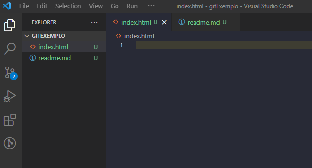

Acima, criei 2 arquivos, um 'index.html' e um 'readme.md', ambos sem nada escrito. Perceba que existe um _U_ maiúsculo. Isso acontece pois estão "_Untracked_" ou não encontrados. Como podemos ver abaixo no GitBash também.

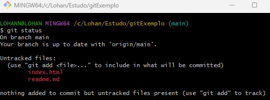

> `git status` nos dá as informações gerais desse repositório.

- Para adicionarmos ao _stading_, iremos usar o comando `git add .`
- Após isso, iremos comitar com uma frase descritiva `git commit -m "adição de arquivos html e readme"`
- Agora, basta aplicarmos o `git push origin main` para enviarmos as mudanças para o repositório remoto.

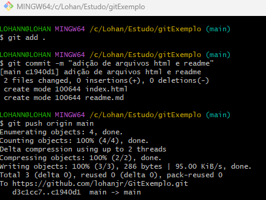

**Prontinho!** Atualize (F5) sua página do GitHub para ver a atualização.

## - Alterações de arquivo | `git diff`

### - Saved but not Staged

Quando salvamos remotamente um arquivo na nuvem, com o comando `push`, e posteriormente quisermos alterá-lo, podemos notar algumas informações do que foi, de fato, alterado.<br>Digamos que eu adicione o esqueleto padrão HTML com o atalho: _! + tab_.

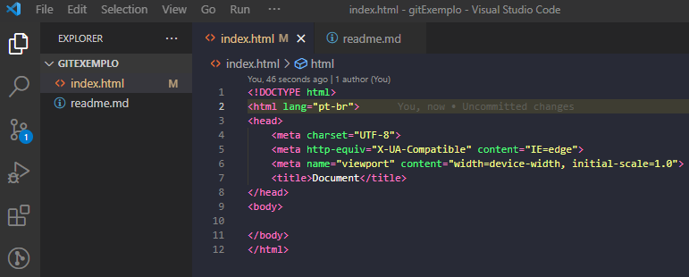

> O '_M_' significa _modified_, agora vamos usar o comando no Git Bash.

Para visualizar as alterações, temos o comando:
```
git diff index.html
```
Que nos mostra o que foi mudado _"pré-commit"_ ou antes do staged (isso é importante!)<br>

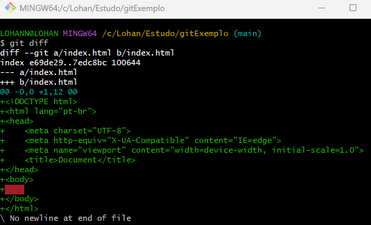

Conseguimos visualizar todo o conteúdo alterado pela linha de comando, super explicativo.

> Para a próxima explicação, leve em conta que irei comitar e dar push à essa modificação.

### *Staged*

Ao alterar o arquivo e usar o comando `git add`, o arquivo se encontrará na área de stading. E o comando para compararmos as mudanças será um pouco diferente.

Irei adicionar um título h1 ao meu body:

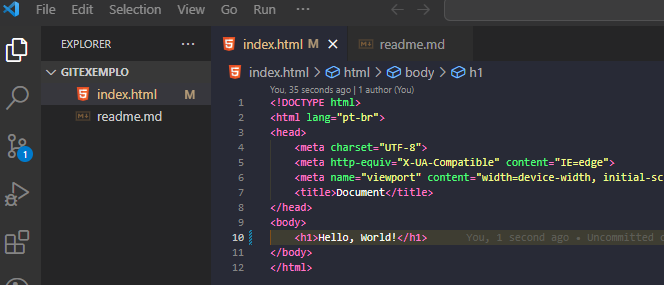

Basta usarmos o comando a seguir para identificarmos as mudanças no arquivo index.html, caso o seu arquivo tenha um nome diferente, basta colocá-lo no lugar.

```
git diff -r HEAD index.html
```

Temos então o mesmo resultado mostrado na command line.

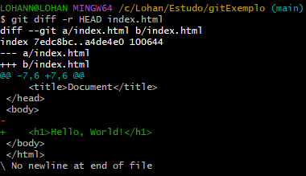

## - Histórico de commits e seus autores | `git log`

Quando falamos em ambientes de versionamento, o trabalho em equipe está incluso nisso, e para boas práticas de desenvolvimento de projetos, temos que manter um ambiente de codificação organizado.<br>
Para isso, temos uma descrição detalhada do histórico de commits, quem o comitou e quando foi feita a alteração.

* Usaremos o comando `git log` para isso.

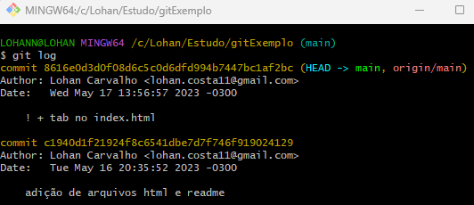

Assim, temos um controle amplo sobre o projeto.